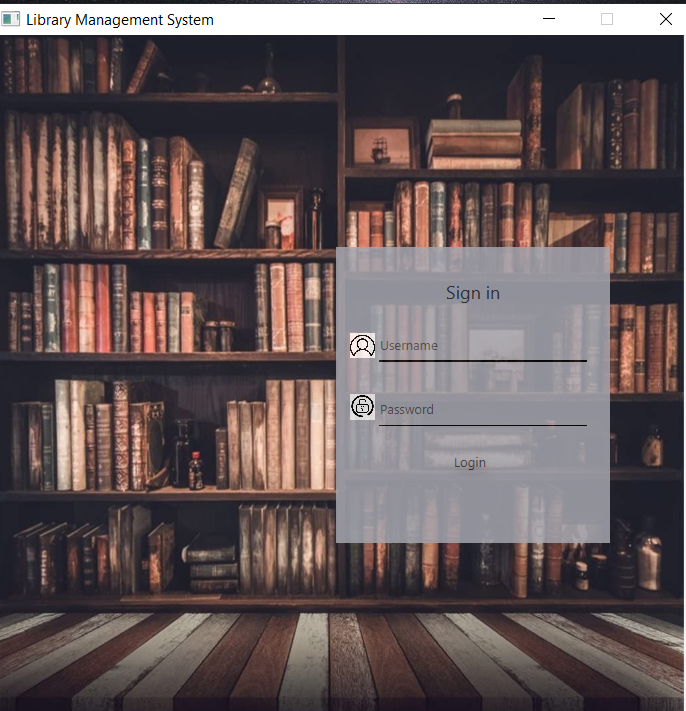
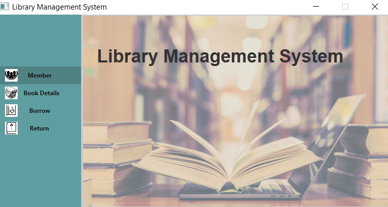
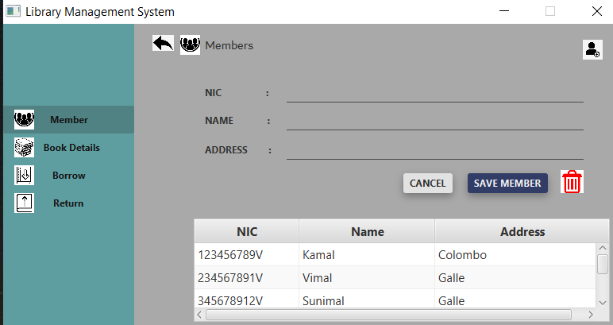
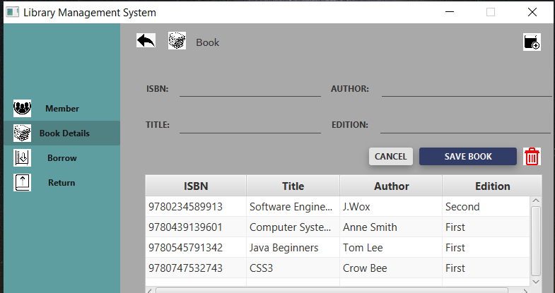
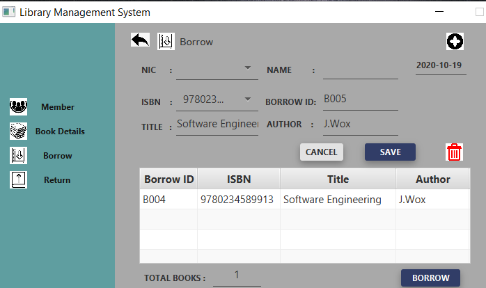
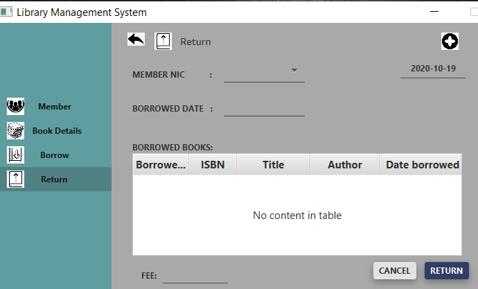

# Library Management System [JDBC]
> Project represents small Library management system using JDBC

## Introduction

This application is simple Library Management system with following functionalities,
        login form    
        member details
        book details
        borrow books 
        return books

## Requirements

Before use this application you must need to install JAVA runtime environment and MYSQL database management services..
links :
    [JAVA](https://www.oracle.com/technetwork/java/javase/downloads/jdk8-downloads-2133151.html) ,
    [MySQL](https://www.mysql.com/)

## Technologies
> JAVA FX | 
> JDBC

## Installation

If you did above installations, You only have to double click the jar file and install the jar file..

## Author

name  : Poornima Vithanage

e-mail : vithanagepurnima@gmail.com

[Github] (https://github.com/poornimavithanage)

## Login

## MainPage

## Managing Members

## Managing Books

## Borrow Books

## Return Books

## Installation

* jfoenix-8.0.8.jar
* mysql-connector-java-8.0.20.jar

## License

This project is licensed under the MIT License - see the [LICENSE.txt](LICENSE.txt) file for details.

